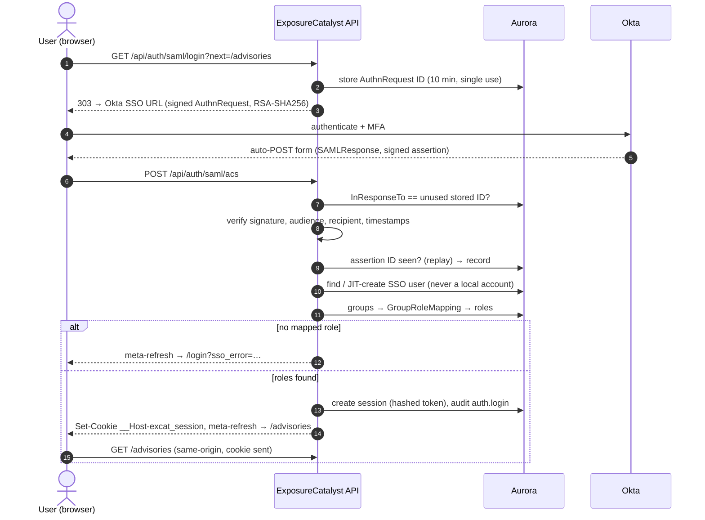
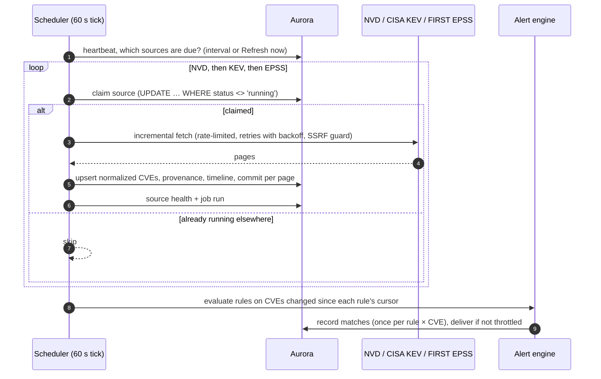
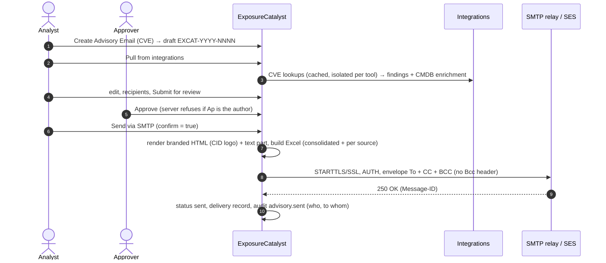
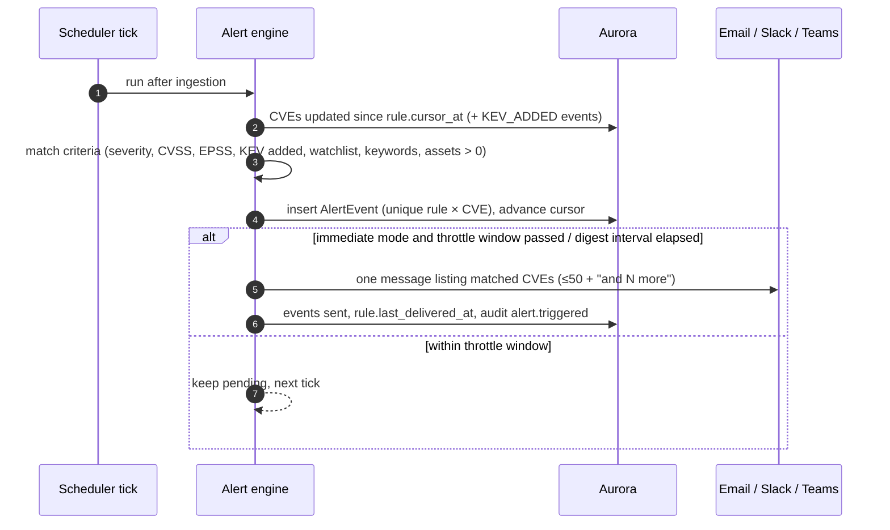

# Sequence diagrams

## SAML sign-in with SailPoint group → role mapping

```mermaid
sequenceDiagram
    autonumber
    actor U as User (browser)
    participant X as ExposureCatalyst API
    participant DB as Aurora
    participant O as Okta
    U->>X: GET /api/auth/saml/login?next=/advisories
    X->>DB: store AuthnRequest ID (10 min, single use)
    X-->>U: 303 → Okta SSO URL (signed AuthnRequest, RSA-SHA256)
    U->>O: authenticate + MFA
    O-->>U: auto-POST form (SAMLResponse, signed assertion)
    U->>X: POST /api/auth/saml/acs
    X->>DB: InResponseTo == unused stored ID?
    X->>X: verify signature, audience, recipient, timestamps
    X->>DB: assertion ID seen? (replay) → record
    X->>DB: find / JIT-create SSO user (never a local account)
    X->>DB: groups → GroupRoleMapping → roles
    alt no mapped role
        X-->>U: meta-refresh → /login?sso_error=…
    else roles found
        X->>DB: create session (hashed token), audit auth.login
        X-->>U: Set-Cookie __Host-excat_session, meta-refresh → /advisories
        U->>X: GET /advisories (same-origin, cookie sent)
    end
```

## Hourly scheduled fetch

```mermaid
sequenceDiagram
    autonumber
    participant S as Scheduler (60 s tick)
    participant DB as Aurora
    participant N as NVD / CISA KEV / FIRST EPSS
    participant A as Alert engine
    S->>DB: heartbeat, which sources are due? (interval or Refresh now)
    loop NVD, then KEV, then EPSS
        S->>DB: claim source (UPDATE … WHERE status <> 'running')
        alt claimed
            S->>N: incremental fetch (rate-limited, retries with backoff, SSRF guard)
            N-->>S: pages
            S->>DB: upsert normalized CVEs, provenance, timeline, commit per page
            S->>DB: source health + job run
        else already running elsewhere
            S-->>S: skip
        end
    end
    S->>A: evaluate rules on CVEs changed since each rule's cursor
    A->>DB: record matches (once per rule × CVE), deliver if not throttled
```

## Advisory send with Excel attachment

```mermaid
sequenceDiagram
    autonumber
    actor An as Analyst
    actor Ap as Approver
    participant X as ExposureCatalyst
    participant T as Integrations
    participant M as SMTP relay / SES
    An->>X: Create Advisory Email (CVE) → draft EXCAT-YYYY-NNNN
    An->>X: Pull from integrations
    X->>T: CVE lookups (cached, isolated per tool) → findings + CMDB enrichment
    An->>X: edit, recipients, Submit for review
    Ap->>X: Approve (server refuses if Ap is the author)
    An->>X: Send via SMTP (confirm = true)
    X->>X: render branded HTML (CID logo) + text part, build Excel (consolidated + per source)
    X->>M: STARTTLS/SSL, AUTH, envelope To + CC + BCC (no Bcc header)
    M-->>X: 250 OK (Message-ID)
    X->>X: status sent, delivery record, audit advisory.sent (who, to whom)
```

## Alert trigger

```mermaid
sequenceDiagram
    autonumber
    participant S as Scheduler tick
    participant E as Alert engine
    participant DB as Aurora
    participant C as Email / Slack / Teams
    S->>E: run after ingestion
    E->>DB: CVEs updated since rule.cursor_at (+ KEV_ADDED events)
    E->>E: match criteria (severity, CVSS, EPSS, KEV added, watchlist, keywords, assets > 0)
    E->>DB: insert AlertEvent (unique rule × CVE), advance cursor
    alt immediate mode and throttle window passed / digest interval elapsed
        E->>C: one message listing matched CVEs (≤50 + "and N more")
        E->>DB: events sent, rule.last_delivered_at, audit alert.triggered
    else within throttle window
        E-->>E: keep pending, next tick
    end
```
